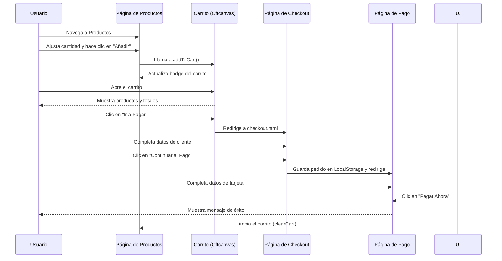

# Documentación Técnica - AceroJJ

## 1. Introducción

Este documento proporciona una descripción técnica detallada del proyecto AceroJJ, una aplicación web para la gestión de un catálogo de productos de acero, pedidos y clientes. La aplicación está construida principalmente con tecnologías front-end (HTML, CSS, JavaScript) y utiliza el almacenamiento local del navegador (`localStorage`) como base de datos para simular la persistencia de datos sin necesidad de un backend complejo en esta fase.

## 2. Arquitectura del Sistema

La aplicación sigue una arquitectura del lado del cliente (client-side) donde la lógica de negocio, la interfaz de usuario y el manejo de datos residen completamente en el navegador.

### Diagrama de Arquitectura
```mermaid
graph TD
    subgraph "Navegador del Cliente"
        A[Usuario] --> B{Interfaz de Usuario (HTML/CSS)};
        B -- Interacciones --> C{Lógica de Aplicación (js/main.js)};
        C -- Lee/Escribe --> D[LocalStorage];
        D -- Datos (JSON) --> C;
    end

    subgraph "Almacenamiento Local (LocalStorage)"
        D;
        subgraph "Datos Almacenados"
            D1[currentUser];
            D2[users];
            D3[catalogCart];
            D4[orders];
            D5[inventory];
        end
    end

    B -- Carga Recursos --> E[Bootstrap 5];
    B -- Carga Recursos --> F[Font Awesome];
    B -- Carga Recursos --> G[Chart.js];

    style A fill:#f9f,stroke:#333,stroke-width:2px;
    style B fill:#bbf,stroke:#333,stroke-width:2px;
    style C fill:#ccf,stroke:#333,stroke-width:2px;
    style D fill:#f96,stroke:#333,stroke-width:2px;
```

-   **Front-end**: Compuesto por archivos HTML estáticos que definen la estructura de las páginas, una hoja de estilos CSS (`style.css`) para el diseño visual (apoyado por el framework Bootstrap 5), y un archivo JavaScript principal (`js/main.js`) que contiene toda la lógica de la aplicación.
-   **Lógica de Negocio**: Centralizada en la clase `AceroJJ` dentro de `js/main.js`. Esta clase maneja la autenticación de usuarios, la gestión del catálogo de productos, el carrito de compras, la creación de pedidos y la visualización de datos en el dashboard.
-   **Persistencia de Datos**: Se utiliza `localStorage` para simular una base de datos. Los datos clave almacenados incluyen:
    -   `currentUser`: Almacena la información del usuario que ha iniciado sesión.
    -   `users`: Una lista de todos los usuarios registrados.
    -   `catalogCart`: Los artículos que el usuario ha añadido al carrito de compras.
    -   `orders`: Un historial de todos los pedidos generados.
    -   `inventory`: La lista de productos disponibles, usada para el dashboard y la gestión de inventario.

## 3. Estructura del Proyecto

```
/
|-- backend/                # (Futuro desarrollo o API simulada)
|-- docs/                   # Documentación del proyecto
|   |-- documentacion_tecnica.md
|   `-- manual_de_usuario.md
|-- images/                 # Recursos gráficos
|-- js/
|   `-- main.js             # Lógica principal de la aplicación (Clase AceroJJ)
|-- *.html                  # Archivos de las diferentes páginas (login, productos, etc.)
`-- style.css               # Hoja de estilos principal
```

### Componentes Clave

#### `js/main.js`

Es el corazón de la aplicación. La clase `AceroJJ` encapsula toda la funcionalidad:

-   **`constructor()` e `init()`**: Inicializan el estado de la aplicación, cargan datos desde `localStorage` y configuran los listeners de eventos.
-   **Autenticación (`initializeAuth`, `login`, `register`, `logout`, `checkAuthState`)**: Gestiona el ciclo de vida de la sesión del usuario, incluyendo un sistema simple de roles (`admin`, `user`).
-   **Gestión de Usuarios (`initializeUserManagement`, `getUsers`, `renderUsersTable`)**: Permite a los administradores ver la lista de usuarios registrados.
-   **Catálogo y Carrito (`initializeCatalog`, `addToCart`, `renderCartOffcanvas`, etc.)**: Controla la visualización de productos, la adición al carrito y la actualización de la interfaz del carrito.
-   **Checkout y Pagos (`initializeCheckout`, `submitCheckout`, `initializePayment`, `processPayment`)**: Maneja el proceso de finalización de compra, desde la recopilación de datos del cliente hasta la simulación del pago.
-   **Dashboard (`initializeDashboard`, `renderSalesTrend`, etc.)**: Exclusivo para administradores, muestra métricas de ventas, pedidos recientes y estado del inventario.
-   **Utilidades (`showNotification`, `formatCurrency`, `formatDate`)**: Funciones de ayuda para tareas comunes como mostrar notificaciones y formatear datos.

#### Archivos HTML

Cada archivo `.html` representa una vista o página de la aplicación:

-   `index.html`: Página de bienvenida.
-   `login.html` / `registro.html`: Formularios de autenticación.
-   `productos.html`: Catálogo de productos para los clientes.
-   `pago.html` / `pedidos.html`: Flujo de compra y visualización de pedidos.
-   `dashboard.html` / `inventario.html` / `usuarios.html`: Vistas exclusivas para el rol de administrador.

## 4. Configuración del Entorno de Desarrollo

Dado que es un proyecto puramente front-end, no se requiere un proceso de compilación complejo.

1.  **Clonar el Repositorio**:
    ```bash
    git clone <URL-del-repositorio>
    ```
2.  **Servidor Local**: Para evitar problemas con las políticas de CORS del navegador al realizar peticiones (como en el fallback a la API de productos), se recomienda servir los archivos a través de un servidor web local.
    -   **Usando VS Code**: La extensión "Live Server" es una excelente opción para iniciar un servidor de desarrollo con un solo clic.
    -   **Usando Node.js**: Si tienes Node.js instalado, puedes usar `http-server`:
        ```bash
        # Instalar globalmente (solo una vez)
        npm install -g http-server

        # Iniciar el servidor en la raíz del proyecto
        http-server
        ```
3.  **Acceder a la Aplicación**: Abre tu navegador y ve a la dirección proporcionada por el servidor local (generalmente `http://127.0.0.1:8080` o `http://localhost:5500`).

## 5. Flujo de Datos

1.  **Inicio de la App**: Al cargar la página, `new AceroJJ()` se ejecuta. El constructor llama a `init()`, que a su vez carga los datos (`users`, `cartItems`, `orders`) desde `localStorage`.
2.  **Login**: El usuario introduce sus credenciales. La función `login()` busca una coincidencia en la lista de usuarios (precargados + registrados). Si tiene éxito, guarda el objeto del usuario en `localStorage['currentUser']` y redirige.
3.  **Añadir al Carrito**: En `productos.html`, al hacer clic en "Añadir", se llama a `addToCart(productId, quantity)`. Esta función actualiza el array `this.cartItems` y lo guarda en `localStorage['catalogCart']`.
4.  **Generar Pedido**: En la página de checkout, los datos del cliente y el contenido del carrito se empaquetan en un objeto de pedido. Este objeto se añade al array de `orders` en `localStorage`.
5.  **Dashboard**: Las funciones del dashboard leen los arrays `orders` e `inventory` de `localStorage` para calcular métricas y renderizar gráficos.

### Diagrama de Flujo de Compra


## 6. Dependencias

-   **Bootstrap 5**: Utilizado para el diseño responsivo y los componentes de la interfaz de usuario (modales, offcanvas, rejilla, etc.).
-   **Font Awesome**: Para los iconos utilizados en toda la aplicación.
-   **Chart.js**: Para la renderización de gráficos en el dashboard de administrador.

Todas las dependencias se cargan a través de CDNs en los archivos HTML, por lo que no se necesita un gestor de paquetes como npm o yarn para el front-end.
